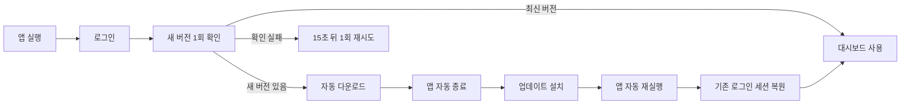
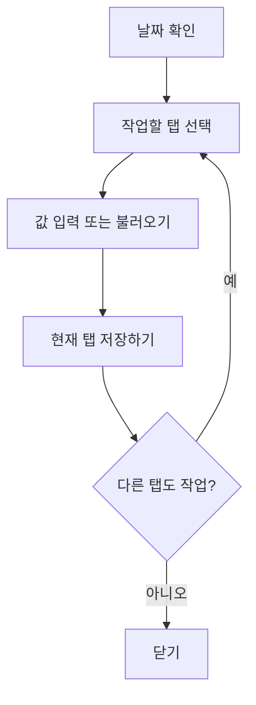

# 오수처리 통합관리시스템 현장 사용자 매뉴얼 원본

> NotebookLM용 기준 문서  
> 대상: 현장관리자 및 현장 근무자  
> 기준 앱: Windows용 Osoo Handle App 1.1.11 이후  
> 문서 목적: 이 문서를 근거로 큰 글씨와 화면 그림이 포함된 쉬운 사용자 설명서를 제작한다.

---

## 0. 설명서 제작 원칙

현장 사용자는 컴퓨터 사용에 익숙하지 않거나 작은 글씨를 보기 어려울 수 있다. 최종 설명서는 다음 원칙을 따른다.

1. 한 화면에는 한 가지 작업만 설명한다.
2. 문장은 짧게 쓰고, 버튼 이름은 실제 화면의 글자와 똑같이 쓴다.
3. 클릭 순서는 큰 원형 번호 `① ② ③`으로 표시한다.
4. 화면 캡처에서는 눌러야 할 곳에 굵은 빨간 테두리와 화살표를 넣는다.
5. 정상 완료 화면과 오류 화면을 각각 보여준다.
6. “저장하기”와 “출력”은 서로 다른 작업임을 반복해서 알린다.
7. 사용자가 고칠 수 없는 오류에서는 복잡한 기술 설명 대신 “화면을 닫지 말고 관리자에게 연락”이라고 안내한다.

### 권장 그림 스타일

- 화면 전체 캡처 1장
- 해당 버튼 확대 그림 1장
- 순서 번호가 있는 화살표
- 정상 상태는 초록색, 주의는 주황색, 오류는 빨간색
- 본문 글자 16pt 이상, 제목 22pt 이상

---

# 1. 자동 업그레이드

## 1-1. 언제 새 버전을 확인하는가

자동업데이트 대상인 일반 Windows 앱은 **현장관리자가 로그인에 성공한 직후 한 번** 새 버전을 확인한다.

- 앱을 켜 놓았다고 몇 분마다 계속 확인하지 않는다.
- 로그인 직후 확인에 실패하면 **15초 뒤 한 번 더** 확인한다.
- 화면 아래 상태표시줄의 **`새 버전 확인`**을 누르면 사용자가 직접 확인할 수 있다.
- Windows 7/8용 32비트 호환판은 자동업데이트 대상이 아니다. 관리자가 새 설치파일로 직접 교체해야 한다.

## 1-2. 업데이트가 발견되면 화면에서 일어나는 일

1. 화면 중앙에 **`새 버전이 검색되어 업그레이드를 진행합니다`**라는 안내가 나타난다.
2. 업데이트 파일이 자동으로 내려받아진다.
3. 화면에 다운로드 진행률이 표시된다.
4. 다운로드가 끝나면 약 1초 뒤 설치를 시작한다.
5. 앱이 자동으로 종료된다.
6. Windows 설치 화면이 잠시 나타날 수 있다.
7. 설치가 끝나면 앱이 자동으로 다시 실행된다.
8. 같은 날 로그인했던 현장관리자 세션은 로컬에서 다시 확인한 후 복원된다.
9. 서버 준비가 필요한 동안 시작 그래픽이 표시되고, 준비가 끝나면 대시보드로 들어간다.

> **중요:** 업데이트 도중 PC 전원을 끄거나 설치창의 취소 버튼을 누르지 않는다.

## 1-3. 업데이트 중 사용자가 해야 할 일

- 기다린다.
- 설치창이 다른 창 뒤에 숨었다면 작업표시줄에서 설치창을 선택한다.
- “앱을 닫아 달라”는 메시지가 나오면 트레이에 남은 앱까지 완전히 종료한 뒤 다시 시도한다.
- 업데이트가 끝난 뒤 로그인 화면이 나오면 평소처럼 로그인한다.
- 앱이 자동으로 대시보드에 들어가면 세션이 정상 복원된 것이다.

## 1-4. 화면 아래 상태표시줄의 의미

| 표시 | 뜻 | 사용자가 할 일 |
|---|---|---|
| 새 버전 확인 | 수동으로 업데이트를 확인할 수 있음 | 필요할 때 한 번 누른다 |
| 새 버전 확인 중 | 서버에서 버전을 확인 중 | 기다린다 |
| 새 버전 확인됨 | 업데이트가 발견됨 | 다운로드와 설치가 끝날 때까지 기다린다 |
| 현재 최신 버전입니다 | 설치된 앱이 최신임 | 그대로 사용한다 |
| 업데이트 오류 | 인터넷 또는 GitHub 연결 실패 | 업무를 계속하고 관리자에게 알린다 |

### 최종 설명서에 넣을 화면

1. 상태표시줄의 `새 버전 확인` 버튼
2. 업데이트 다운로드 진행창
3. Windows 설치 진행창
4. 재실행 후 시작 그래픽
5. 세션 복원 후 대시보드

---

# 2. 통합 데이터 입력창 사용법

## 2-1. 통합 데이터 입력창 열기

통합 데이터 입력창은 다음 메뉴에서 열 수 있다.

- 유량관리
- 수질분석
- 약품관리
- 키트관리

기본 순서:

1. 왼쪽 메뉴에서 작업할 메뉴를 누른다.
2. 그리드에서 입력할 날짜의 행을 한 번 누른다.
3. **`통합입력`** 버튼을 누른다.
4. 오른쪽 위 날짜가 선택한 날짜와 같은지 확인한다.

처음 메뉴에 들어왔을 때는 오늘 날짜가 기본으로 선택된다. 그리드를 스크롤만 한 경우 선택 날짜는 바뀌지 않는다. 다른 날짜를 작업하려면 반드시 그 날짜의 행을 다시 클릭한다.

## 2-2. 화면 구성

통합 데이터 입력창에는 네 개의 탭이 있다.

1. **유량관리**
2. **수질분석**
3. **약품관리**
4. **키트관리**

각 탭 아래의 저장 버튼은 **현재 보고 있는 탭의 자료만 저장**한다.

예:

- 유량관리 탭의 `유량관리 저장하기` → 유량 자료만 저장
- 약품관리 탭의 `약품관리 저장하기` → 약품 자료만 저장

다른 탭에 입력만 하고 저장하지 않았다면 창을 닫을 때 저장하지 않은 작업이 있다는 안내가 표시된다.

> **중요:** 탭을 바꾸었다고 자동으로 저장되지 않는다. 각 탭에서 반드시 `저장하기`를 누른다.

## 2-3. 날짜를 바꿀 때

1. 오른쪽 위 달력 버튼을 누른다.
2. 작업할 날짜를 선택한다.
3. **`데이터 확인 중...`** 표시가 끝날 때까지 잠시 기다린다.
4. 기존 자료가 있으면 입력칸에 자동으로 나타난다.
5. 기존 자료가 없으면 빈 입력칸 또는 기본값이 나타난다.

날짜를 바꾸면 앱은 선택 날짜의 자료와 전날 자료를 다시 확인한다. 확인이 끝난 뒤에는 모든 입력칸을 클릭하고 수정할 수 있어야 한다.

## 2-4. 유량관리 탭

### 일반 입력

1. 날짜를 확인한다.
2. 각 유량계의 **검침값**을 입력한다.
3. 앱이 전날 검침값과 비교하여 사용량을 계산한다.
4. 계산된 사용량을 확인한다.
5. `유량관리 저장하기`를 누른다.

과거 날짜를 입력할 때도 선택한 날짜의 바로 전날 값을 기준으로 계산한다.

### 기준값 입력

`기준값`은 관리자만 사용하는 초기 자료 입력 기능이다.

- 검침값과 사용량을 관리자가 직접 입력한다.
- 자동계산하지 않고 입력한 값을 그대로 저장한다.
- 한 번 저장하면 기준값 입력 상태가 자동으로 풀리고 이후 날짜부터 정상 자동계산한다.

### 전력량을 MWh로 입력하는 현장

- 전력 검침값이 메가와트시 단위라면 **MWh 선택 항목**을 켠다.
- 검침값은 화면에 입력한 소수값 그대로 보관한다.
- 사용량은 자동으로 1,000을 곱한 kWh로 계산한다.
- MWh 선택 상태는 사용자가 해제하기 전까지 유지된다.

### 슬러지 반출량

1. 유량관리 탭 왼쪽 목록에서 `슬러지`를 선택한다.
2. 반출량을 입력한다.
3. 반출량이 입력되면 `반출사진`과 `청소필증` 버튼이 활성화된다.
4. 사진을 선택한다.
5. `유량관리 저장하기`를 누른다.

월 반출량은 선택한 달의 반출량 합계로 표시되며, 저장 데이터의 누계는 연간 누계로 관리된다.

## 2-5. 수질분석 탭

### 수동입력

1. `수동입력`을 선택한다.
2. 분석장소별 측정값을 입력한다.
3. 하루에 여러 번 실험했다면 회차를 추가한다.
4. `수질분석 저장하기`를 누른다.

### 자동입력

1. `자동입력`을 선택한다.
2. 하루 자료는 **`서버에서 가져오기`**로 불러온다.
3. 여러 날짜는 시작일과 종료일을 지정하고 **`기간불러오기`**를 누른다.
4. 확인창에서 내용을 확인하고 `확인`을 누른다.
5. 진행창에서 완료 건수와 오류 건수를 확인한다.
6. 불러온 수질값을 화면에서 확인한다.

기간불러오기는 서버자료를 날짜별로 처리하며 즉시 저장될 수 있다. 작업 중 창을 닫지 않는다.

한 날짜에 실험이 3회 있었다면 1회차, 2회차, 3회차 자료가 모두 표시되어야 한다.

## 2-6. 약품관리 탭

1. 날짜를 확인한다.
2. 입고량이 있으면 구매/입고량을 입력한다.
3. 당일 사용량을 입력한다.
4. 현재 재고가 자동계산되는지 확인한다.
5. `약품관리 저장하기`를 누른다.

쉼표가 들어간 숫자나 문자 대신 숫자와 소수점만 입력한다.

## 2-7. 키트관리 탭

1. 날짜를 확인한다.
2. **`자동실험횟수 조회`**를 누르면 저장된 수질 실험결과를 기준으로 키트 사용량 초안을 불러온다.
3. 필요하면 `실험횟수 +`, `실험횟수 -` 또는 입력칸을 직접 수정한다.
4. 입고량이 있으면 구매/입고량을 입력한다.
5. 재고를 확인한다.
6. `키트관리 저장하기`를 누른다.

실험횟수 증감 기준:

- 인산염인 키트: 한 번 누를 때 3개씩 증감
- 나머지 키트: 설정된 분석장소 수만큼 증감

예: 분석장소가 5곳이면 `+` 한 번으로 일반 키트는 5개, 인산염인 키트는 3개 증가한다.

### 최종 설명서에 넣을 화면

1. 그리드에서 날짜 행을 선택한 화면
2. 통합입력 버튼
3. 네 개 탭의 위치
4. 날짜 선택 달력
5. 탭별 저장 버튼
6. 유량 검침값과 자동계산 사용량
7. 수질 자동입력과 기간불러오기
8. 키트 자동실험횟수 조회
9. 슬러지 반출사진·청소필증 버튼

---

# 3. 각종 일지 메뉴 사용법

`일지작성` 메뉴 아래에서 필요한 일지를 선택한다.

## 3-1. 일일업무일지

1. `일지작성 → 일일업무일지`를 누른다.
2. 왼쪽 달력에서 출력할 날짜를 누른다.
3. 여러 날짜를 출력하려면 날짜를 차례로 선택한다.
4. 오른쪽 현황판에서 데이터 누락 여부를 확인한다.
5. 출력 형식에서 `한글(HWP)` 또는 `PDF`를 선택한다.
6. 해당 버튼을 눌러 출력한다.

양방향 통합관리 현장은 `출력 현장` 목록이 나타날 수 있다. 반드시 출력할 방향을 확인한 후 출력한다.

HWP 출력은 한글 프로그램이 설치되어 있어야 한다. PDF 출력이 실패하면서 한글 프로그램 안내가 나타나면 관리자에게 알린다.

## 3-2. 수질분석일지

1. `일지작성 → 수질분석일지`를 누른다.
2. 왼쪽 달력에서 날짜를 선택한다.
3. 오른쪽 현황판에서 수질 데이터와 분석사진 수를 확인한다.
4. `분석일지 출력`을 누른다.
5. 생성된 엑셀 일지가 열리면 값과 사진을 확인한다.

수질값이 비어 있으면 먼저 수질분석 메뉴에서 해당 날짜의 서버자료를 불러오거나 수동입력한다.

## 3-3. 약품관리대장

1. `일지작성 → 약품관리대장`을 누른다.
2. 출력할 월을 선택한다.
3. 입고량, 사용량, 재고가 맞는지 확인한다.
4. 관리대장 출력 버튼을 누른다.

재고가 맞지 않으면 출력 전에 약품관리 메뉴의 날짜별 입고량과 사용량부터 확인한다.

## 3-4. 약품입고일지

이 화면은 약품 사진대지와 키트 사진대지를 함께 관리한다.

1. `일지작성 → 약품입고일지`를 누른다.
2. 연도와 월을 선택한다.
3. `약품` 또는 `키트` 탭을 선택한다.
4. 입고 날짜와 입고량을 입력한다.
5. 각 항목의 `사진` 버튼으로 사진을 선택한다.
6. 약품은 필요하면 거래명세서 사진도 선택한다.
7. 왼쪽 아래 `저장` 버튼을 누른다.
8. 오른쪽 미리보기에서 사진 배치를 확인한다.
9. `약품입고일지 출력`을 누른다.

## 3-5. 슬러지사진대지

1. `일지작성 → 슬러지사진대지`를 누른다.
2. 연도와 월을 선택한다.
3. 반출 기록이 있는 날짜를 선택한다.
4. `반출사진`과 `청소필증`을 확인하거나 추가한다.
5. 필요하면 `반출관리대장 출력`을 누른다.
6. 사진대지가 필요하면 `사진대지 출력`을 누른다.

사진이 서버에만 있고 PC에 없으면 내려받을 것인지 묻는 창이 나타날 수 있다. 이때 `확인`을 누르면 해당 현장 사진을 내려받는다.

## 3-6. 월운영보고서

1. `일지작성 → 월운영보고서`를 누른다.
2. 연도와 월을 선택한다.
3. 유입량, 방류량, 슬러지 반출량, 약품 사용량 집계를 확인한다.
4. 출력 버튼을 누른다.
5. 생성된 엑셀 파일의 수식 결과를 확인한다.

월운영보고서 원본에는 현장별로 수정한 내용이 있을 수 있으므로 사용자가 원본 양식을 임의로 교체하지 않는다.

### 최종 설명서에 넣을 화면

- 일지작성 하위 메뉴 전체
- 달력에서 날짜를 선택한 모습
- 오른쪽 데이터 현황판
- HWP/PDF 선택 버튼
- 출력 중 화면
- 약품/키트 사진대지 미리보기
- 슬러지사진대지의 날짜별 사진 목록

---

# 4. 사진 업로드 방법

## 4-1. 공통 원칙

1. 먼저 날짜가 맞는지 확인한다.
2. 사진 버튼을 누른다.
3. Windows 파일 선택창에서 사진을 선택한다.
4. 화면에 `사진 있음`, 선택 장수 또는 미리보기가 나타나는지 확인한다.
5. 반드시 화면의 `저장` 버튼을 누른다.
6. 저장 완료 메시지가 나온 뒤 창을 닫는다.

사진은 먼저 현장 PC의 로컬 사진 폴더와 데이터베이스에 저장되고, 백그라운드에서 Google Drive 동기화를 시도한다. 인터넷이 잠시 끊겨도 로컬 저장 성공 여부를 먼저 확인한다.

## 4-2. 슬러지 반출사진

### 통합입력창에서 등록

1. 유량관리 탭에서 `슬러지`를 선택한다.
2. 반출량을 입력한다.
3. 활성화된 `반출사진`을 누른다.
4. 필요한 사진을 여러 장 함께 선택한다.
5. `유량관리 저장하기`를 누른다.

### 슬러지사진대지에서 등록

1. 슬러지사진대지 메뉴를 연다.
2. 반출 날짜를 선택한다.
3. `반출사진`을 눌러 사진을 선택한다.
4. 저장한다.

## 4-3. 청소필증

1. 슬러지 반출량이 있는 날짜를 선택한다.
2. `청소필증` 버튼을 누른다.
3. 청소필증을 촬영한 사진 또는 스캔 이미지를 선택한다.
4. 저장한다.
5. 사진대지 미리보기에서 올바른 문서인지 확인한다.

## 4-4. 약품 입고사진

1. 약품입고일지 메뉴를 연다.
2. `약품` 탭을 선택한다.
3. 입고 날짜를 지정한다.
4. 약품별 입고량을 입력한다.
5. 해당 약품 행의 `사진`을 누른다.
6. 약품 포대, 통 또는 입고 물품이 잘 보이는 사진을 선택한다.
7. 거래명세서가 있으면 거래명세서의 `사진`도 선택한다.
8. 저장 후 오른쪽 미리보기를 확인한다.

## 4-5. 키트 입고사진

1. 약품입고일지 메뉴를 연다.
2. `키트` 탭을 선택한다.
3. 입고 날짜와 키트별 입고량을 입력한다.
4. 각 키트의 `사진`을 누른다.
5. 저장 후 미리보기를 확인한다.

현재 키트 입고일지 출력에는 최대 2장의 키트 사진이 배치된다.

## 4-6. 좋은 사진의 기준

- 글자가 흔들리지 않고 선명하다.
- 사진을 가로 또는 세로로 지나치게 기울이지 않는다.
- 약품명, 수량 또는 청소필증 내용이 잘리지 않는다.
- 같은 사진을 여러 번 올리지 않는다.
- 사진 선택 후 저장 완료 메시지를 확인한다.

---

# 5. 성적서 보기 및 다운로드

성적서는 중앙에서 현장명으로 분류하여 올린 JPG 이미지이다. 현장 앱에서는 목록 또는 큰 미리보기로 확인하고, 선택한 성적서를 하나의 PDF로 내려받을 수 있다.

## 5-1. 성적서 찾기

1. `수질관리 → 성적서`를 누른다.
2. 기본 화면인 `미리보기`에서 성적서 첫 화면들을 확인한다.
3. 간단한 목록이 편하면 위쪽의 `목록`을 누른다.
4. 다시 큰 그림으로 보려면 `미리보기`를 누른다.
5. 연도, 월 또는 검색 조건이 있다면 필요한 조건을 선택한다.

## 5-2. 한 장 다운로드

1. 필요한 성적서 카드 또는 목록 왼쪽의 체크박스를 누른다.
2. 화면 아래의 `PDF 다운로드 (1)`을 누른다.
3. 저장 위치를 선택한다.
4. 내려받은 PDF를 열어 내용을 확인한다.

## 5-3. 여러 장을 하나의 PDF로 다운로드

1. 필요한 성적서를 차례로 체크한다.
2. 모두 필요하면 `전체 선택`을 누른다.
3. 선택 개수가 맞는지 `PDF 다운로드 (개수)` 표시를 확인한다.
4. `PDF 다운로드`를 누른다.
5. 선택한 JPG 성적서가 페이지별로 합쳐진 하나의 PDF로 저장된다.

> **중요:** 성적서 원본은 JPG이지만 다운로드 결과는 여러 장을 묶은 PDF이다.

## 5-4. 성적서가 보이지 않을 때

- 인터넷 연결을 확인한다.
- 현장명이 올바르게 설정되어 있는지 관리자에게 확인을 요청한다.
- 중앙에서 아직 성적서를 올리지 않았을 수 있다.
- 화면을 다시 열거나 앱을 한 번 재실행한다.

### 최종 설명서에 넣을 화면

1. `목록 / 미리보기` 전환 버튼
2. 미리보기 카드의 체크박스
3. `전체 선택`
4. 여러 장 선택 후 `PDF 다운로드 (3)`처럼 개수가 표시된 상태
5. 내려받은 여러 페이지 PDF

---

# 6. 현장 사용자를 위한 공통 문제 해결

| 증상 | 먼저 할 일 |
|---|---|
| 버튼을 눌러도 반응이 없음 | 5초 기다린 뒤 한 번만 다시 누른다 |
| 입력칸에 글자가 안 써짐 | 날짜의 `데이터 확인 중...`이 끝났는지 확인한다 |
| 저장 후 값이 안 보임 | 해당 메뉴를 다시 열거나 새로고침한다 |
| 사진 버튼이 비활성화됨 | 날짜와 반출량 또는 입고량을 먼저 입력한다 |
| 출력 파일이 열리지 않음 | 한글 또는 엑셀 프로그램이 설치되어 있는지 확인한다 |
| 업데이트 설치가 멈춤 | 설치창이 다른 창 뒤에 숨었는지 작업표시줄을 확인한다 |
| 서버 연결 오류가 표시됨 | 앱을 완전히 종료한 뒤 다시 실행하고, 반복되면 관리자에게 알린다 |

관리자에게 문제를 알릴 때 다음 세 가지를 함께 전달한다.

1. 현장명과 방향
2. 문제가 생긴 날짜와 메뉴
3. 오류 화면 사진

---

# 7. NotebookLM에 요청할 최종 산출물

이 문서를 NotebookLM에 넣은 뒤 다음과 같이 요청한다.

> “이 원본 문서만 근거로 60대 이상 현장근무자도 따라 할 수 있는 Windows 앱 사용자 설명서를 만들어 주세요. 각 작업을 ① ② ③ 순서로 나누고, 한 페이지에 한 가지 작업만 배치하세요. 실제 화면 캡처가 들어갈 곳에는 `[화면 캡처: 설명]`이라고 표시하고, 눌러야 할 버튼에는 빨간 테두리와 화살표를 넣도록 이미지 편집 지시를 작성하세요. 기술용어는 최소화하고, 정상 완료 표시와 주의사항을 큰 글씨로 분리하세요.”

권장 결과물:

1. 전체 PDF 사용자 설명서
2. 메뉴별 1장짜리 간편 설명서
3. 자동업데이트 안내문
4. 통합입력 빠른 사용법
5. 사진 업로드 빠른 사용법
6. 성적서 다운로드 빠른 사용법
